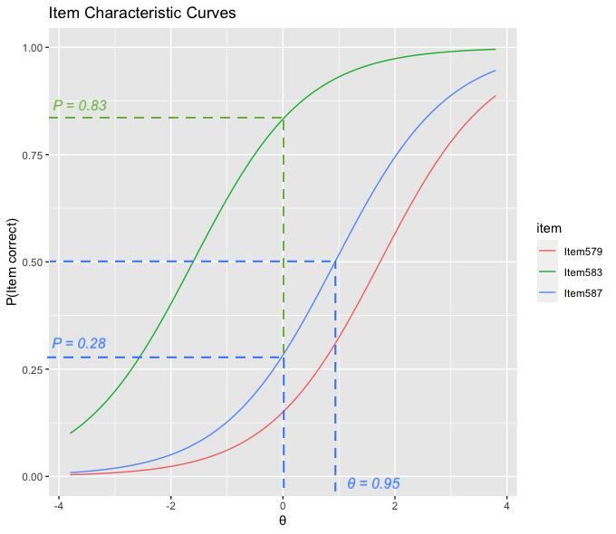
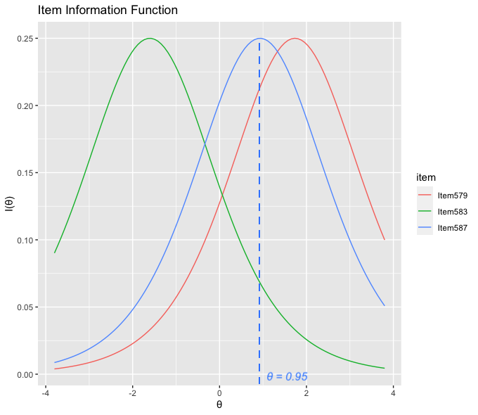
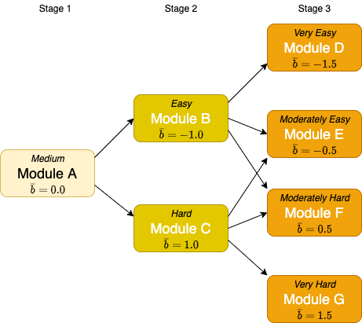
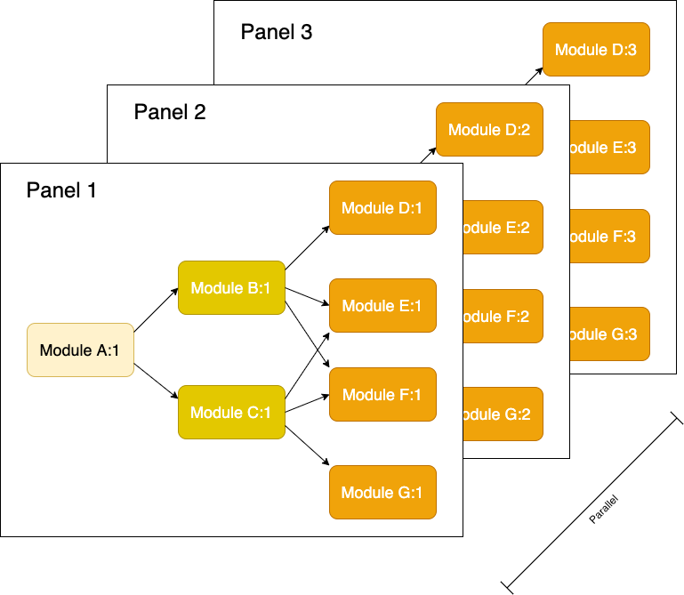

## Overview

Computerised multistage tests (MSTs) have grown in popularity in recent years due to their advantages of flexibility and simplicity over linear and computerised adaptive tests (CATs). A growing body of academic literature is available for researchers, however the practicalities of using MST for the design and delivery of real-world tests is still difficult to access. 

In this series of posts that I hope to provide a useful practical guide to test design and delivery. The first post will cover the **initial design** of these types of test. 

In later posts I'll cover the following:

- The development of MSTs
- The validation of MSTs
  - Test construction
  - Trialling
  - Scoring and routing 

As we explore these topics we’ll consider an example *item* which will follow a lifecycle from when it is first conceived, developed, rated and trialled, banked in the item bank, delivered as part of one or more test administrations, and finally retired from use. We will also consider a hypothetical *candidate* and follow their *journey* from being entered to take the test, being routed between the different stages of the test, and receiving a final score and report on their results.

# The Design of MSTs

The advantages of splitting tests up into units of items called *modules* and directing candidates to these modules based on their latent ability estimates provides a more efficient test delivery than a corresponding linear test, whilst also offering an easier method of assembly, and greater protection against test copying.

We'll assume some familiarity with Item Response Theory (IRT) - and the Rasch model. Some knowledge of programming with R would be useful to understand the examples given. For background information and primers on these subjects we provide references.

The main focus is the development of tests for language learners, specifically English language learners. The theory and data processing involved can  be transferred to other domains that require measurement of latent ability. The IRT model that we focus on is the 1PL (or Rasch) model. For readers interested in extending analysis to more complex models, see @magis2017computerized.

Developing a new test is a complex, multi-disciplinary task, involving content experts, specialist item writers, psychometricians, software engineers, validation experts and project managers. It is essential, before beginning any of this work to have a clear vision of what you are seeking to test, and the types of candidates that you will be targeting along with their needs. The main tasks when developing a new test will include:

* Blueprint, test specification and test design
* Simulation
* Item writing
* Item review and rating
* Pilot/Live trial
* Rasch modelling and item banking
* Establishing cut scores and scale scores
* Live test

See Chapter 1 of @lane2015handbook for a concise introduction to the main considerations of developing a new test.

Once the live test has been launched, continual monitoring and adjustment of the test will be essential to ensure that it remains secure and delivers on the targeted goals over the long term.

## Constraints and Assumptions

This article focuses on practical solutions to problems that may be encountered during a test design. Lack of sufficient data, particularly in the early stages of design, is a perennial problem. The ability to validate the design at an early stage with simulated data is therefore important and will be covered here.

In addition, the test delivery system may be restricted in its ability to access the item bank to derive item difficulties. In this case, mapping functions to derive ability estimates and scale scores as well as provision of the cut scores for module routing must be provided in advance of test administration for each panel. We demonstrate methods that can be used to provide these values.

## Introduction to Item Response Theory

When you deliver a test to a set of candidates, how can you be sure that you are measuring those candidates in the same way, even though the test administrated to one candidate has different items from that administered to another candidate?

The underlying theoretical basis for MST is the branch of psychometrics known as Item Response Theory, or IRT. The theory proposes that there are *latent traits* (for example language ability) that can be measured using a set of items delivered to the test candidate. These test items are typically scored as correct (1) or incorrect (0) - and it is these dichotomous item types that we focus on here. It is also possible to offer polytomous item types (for example based on Likert scales, or partial credit items), but we won't cover those in this article.

The responses to the test items can then be used to estimate the candidate's latent ability. This can be done by first fitting an IRT model to a response dataset collected during the trial phase. This model can then be used to make predictions about latent ability based on item responses once the test goes live. The latent ability estimates can then be converted into a scale score, an ability summary, or both. The rest of this document provides practical examples of designing a multistage test, fitting an IRT model and calculating scores.

MSTs differ from linear and CATs in that the test items are grouped into modules that can be delivered as separate but linked units as part of a test administration. Progression from module to module is dictated by the candidate's estimated ability, with cut-scores determining the next module to progress to.

### The Rasch Model

The simplest IRT model, the so-called *Rasch model*, applies logistic regression to items, using responses from a set of trial candidates. If you're familiar with linear regression, then the idea behind logistic regression is that the model fits a probability range (between 0.0 and 1.0) rather than a dependent variable. The independent variables are the difficulty of the item (usually designated as $b$), and the latent ability (which is denoted $\theta$). Because it only factors in the difficulty parameter of the item, it is also known as the one-parameter logistic model (1PL). Here's the *item response function* (IRF) that is used to model the probability of a correct response for candidate $i$ taking test item $j$:

$$
Pr(X_{ij} = 1|\theta_{i},b_{j}) = \frac{exp(\theta_{i} - b_{j})}{1+exp(\theta_{i} - b_{j})}
$$

$Pr(X_{ij} = 1)$ is the probability of a correct response, $\theta_i$ represents the latent ability of the candidate being measured, and $b_j$ represents the difficulty of item $j$. Certain assumptions are made by the model, most importantly:

* Each item targets one and only one latent trait
* The items are independent of one another
* The response probability increases with the ability level using the item response function described above

### Item Difficulty and the Item Characteristic Curve

For every item, the probability that the item will be answered correctly can be visualised by plotting an Item Characteristic Curve (ICC), which uses the above logistic function. Figure 1 plots the ICCs for three items: Item579 (red), Item583 (green) and Item587 (blue).

There is an equivalence between $\theta$ and $b$. In this example a candidate with mean ability ($\theta = 0$) would be expected to get item 587 (blue) correct with a probability of 0.28. The same candidate would have a a probability of 0.83 of getting the less difficult item 583 (green) correct. The further to the right the sigmoid is the more difficult the item is, with item 868 (red) being the most difficult of the three.

The slope of the curve indicates how discriminating the item is. An item that is very discriminating will have a steep curve; one that is less discriminating will have a flatter curve. Highly discriminating items have more measurement information. Ideally you want to have many discriminating items to be able to provide a lower error in your ability estimate. In general, the more items you are able to trial with, the more information (and less error) you will have.

### Item Discrimination and the Item Information Function

An item that all candidates always get right because it is too easy has very little informational value for test purposes. The same is true of test items that all candidates always get wrong because they are too hard. It's telling you very little about the ability levels of your candidates. From this it follows that an item where half the candidates answer correct and the other half answer wrong has the most informational value; this is the point where $\theta$ and $b$ are equal, so the item is perfectly targeted at the ability of these candidates. This relationship can be expressed by the Item Information Function (IIF). In the 1PL model the maximum value of the IIF is 0.25 (it can be different in the other models due to the influence of the discrimination parameter $a$). Figure 2 displays the IIFs for the same three items as before.

The information function is expressed as:

$$
I_i(\theta, b_i) = P_i(\theta, b_i)Q_i(\theta, b_i)
$$

Where P is the probability of getting the item correct (for a given ability), and Q is the probability of getting it wrong.

As mentioned, greater information implies a smaller error of measurement. When designing a test it is important to deliver items with a range of difficulties that match the expected ability ranges of the candidates so that you can accurately measure the your target candidates. In the above diagram you can see that Item 587 (blue) is good at measuring candidates around ability level 0.95. Item 583 (green) is better at measuring candidates with a lower ability level.

### Logits

The log odds, or *logit* of a correct response can be expressed (in the Rasch model) as $\theta - b$; so if a candidate has a latent ability level ($\theta$) which happens to be equal to the difficulty of our item $b_{583}$, then the odds are even (1:1) that they will answer it correctly (in other words a 50% chance of getting it right, and a 50% chance of getting it wrong). The logit value here would be 0 (this is also the point of maximum information for the item). The logit function is the inverse of the logistic function described earlier:

$$
logit(p) = log(\frac{p}{1-p})
$$

Where $p$ is the probability of getting a correct response.

### Test Item Lifecycle

The item response function is a logistic function with a characteristic sigmoid (or 'S' shape), and can be plotted for each item. Throughout the rest of this article we'll consider an example item, **Item583**, which will follow a *lifecycle* from when it is first conceived, developed, rated and trialled, banked in the item bank, then delivered as part of one or more test administrations, and finally retired from use.

Of course, this item is just one of many that will, over time, be added into an item bank. The item will have a number of properties and metadata that describes it. For example the name of the item writer who created it, the skill it is targeting, the sub-skills required, a set of media (audio, video or image files) that is associated with it and which serve as stimuli, the instructions, the prompt question, and importantly for our purposes, the difficulty coefficient $b$. The rest of this article follows this life cycle, in particular how it relates to the various IRT methodologies for design and validation of multistage tests.

## Blueprint and test specification

When designing any test, it is important to ensure that items are written to the target ability range that you want to measure. Subject Matter Experts (SMEs) will need to be involved in the initial test design to make decisions about the length of the test and the components (skills as R,L,S,W, or any combination of these) for the target candidature.

In a multistage test, modules need to be constructed in such a way that they target a specified ability range. We'll see later on how a Module Information Function can be used to help with module routing decisions. Also, routing needs to be designed with overlapping items between adjacent modules.

## IRT for Multistage Test Design

IRT is used to inform calibration of the test items after they've been developed by item writers, as well as construction of the modules and routing between them. Scoring of the test can be derived from the ability estimates. Typically the initial module (known as the routing module) will have an overall difficulty of 0 (ie. a mix of easy and hard items), with subsequent routing directing candidates to easier or more difficult modules in order to 'hone in' on an accurate $\hat{\theta}$ (ability estimate) at the end of the test.

A typical modular design for a MST will look like the one in Figure 3 which is an example of a 1-2-4 design. Other designs are possible. 

Important questions to answer during test design include what module topology to use (the number of stages, and the number of modules per stage), and what overall difficulty level should be used for each module (represented by the mean item difficulty, $\bar{b}$).

## MST Design Considerations

As mentioned earlier, multistage test designs comprise a number of modules arranged into stages. The question then becomes, how many stages do we need, and how many modules in each stage do we want? We saw earlier an example of a simple 1-2-4 design.

This design may not be sufficient for your needs. You need to consider whether there are groups of items that naturally fit into a particular stage (for example, separating reading or listening tasks into separate stages). You also need to consider how many items per stage you want to have. Also, in order for the routing between modules to produce acceptable results, you need to consider the relative difficulty of each module.

Normally the so-called routing module in stage 1 (Module A) would contain a mix of items with a mean difficulty of 0 (in other words ‘medium’ difficulty). Candidates that are placed in the lower ability range at the end of this module will be routed to the ‘easy’ module in stage 2 (Module B), and those in the upper ability range to the ‘hard’ module (Module C).

## Panels

A benefit of using modules is that items can be placed into modules and then delivered as parallel test forms called *panels*. Having multiple panels helps to reduce item exposure rate as previously seen panels can be precluded from selection for future test administrations. It also makes it easier to assemble tests. It is possible to place items in more than one panel, but its important to ensure that parallel panels are of equivalent difficulty, see Figure 4.

When constructed in this way each module can be considered as a module instance (for example Module D:3 being the instance of module D in panel 3), Once the test topology has been decided, the first panel can be developed as a prototype.

# References
