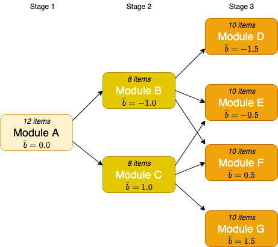

```{r setup, include=FALSE}
library(kableExtra)
library(tidyverse)
library(janitor)

knitr::opts_chunk$set(
  comment = '', fig.width = 6, fig.height = 6
)
```

In this post we'll describe the steps required for the development of a computerised multistage test (MST). In particular we'll look at initial validation of a test design. The [previous post](/2021/03/08/mst-primer-1/) considered some of the design considerations you need to think about when developing a new **multistage test** (MST). This post shows some examples of how to perform this validation using R. 

## Simulation

In the pre-trial stage, it is useful to run simulations to help us answer the questions posed in the previous part of this article. The results of these simulations will help inform final decisions about the test design. It's always less expensive to make modifications to a design early on in the process, before significant investment in item writing and trialling has been made. The ability to simulate a test at the design phase can be used to understand the constraints of the design at an early stage and make changes in a low-cost, low-risk way. In this post we'll show how the [`mstR` R package](https://cran.r-project.org/web/packages/mstR/) can be used to run simulations for a MST design. First though we'll cover the data sources that we'll be using.

## Data Sources and Management

In order to perform a simulated test, there are a number of different data sources that are required. To start with we need to consider the following entities that will be used to construct a test:

* Items
* Modules
* Panels

In addition to the item information, another data source is required for storing candidate information. This forms the candidate information system (CIS) that will be used for the test. In addition to storing a unique candidate ID, additional metadata of interest, such as the candidate's length of study or first language (L1), may be held by the CIS.

Finally, test response data is required. Essentially this is a matrix containing rows of candidates and columns of items. Cells in the matrix contain a 1 (item answered correctly) or a 0 (item answered incorrectly). Items that were not presented (for example, from a module that was not in the test path for a candidate) are left blank and are classed as NA.

This data may be stored as flat files (in CSV format for instance), or held in database tables, or in a mix of different sources. Typically a cloud storage system will be used (for example in AWS S3 buckets or in a cloud database such as Amazon RDS). This is to ensure that the data is stored in a way that is secure, accessible and geographically distributed (for resilience).

## Pre-Trial Simulation and Design

An initial simulation of the test can be used to experiment with different designs. We show how to do this using the `mstR` library (see @magis2017computerized). Here the aim is to select a set of designs and see if there is an optimal one It will also help understand how the scoring of the test should be implemented, including the number correct (NC) scores that will be used for routing, and the ability estimates for final scoring and reporting.

The `mstR` library can take an existing set of item responses, or you can use it to generate a set of randomised simulated item responses. This latter ability is useful in the pre-trial stage where we're interested in finding out how routing between modules should be established, or to validate assumptions in the test design.

The aim here is to sift through several different test designs with a view of converging on the optimal design for the . The ability to re-run simulations easily with different design parameters provides a powerful means of trying out different design ideas before incurring the costs of engaging item writers, raters and trial candidates.

### Module Setup

With `mstR` it is possible to define:

* the module topology (number of stages, and modules per stage)
* the number of items per module and the average module difficulty
* the IRT model to use

Assuming the 1-2-4 pattern described in the [previous post](/2021/03/08/mst-primer-1/), with a total of 30 items (12 + 8 + 10), a simulation for the test design can be created from the following elements:

* a simulated item bank
* the modules and the items they contain
* the routing rules in the transition matrix

Average difficulty levels for each module are shown in Figure \@ref(fig:module-items), where $\bar{b}$ is the mean difficulty of the module, and a standard deviation of 1 is assumed.

```{r module-items, echo=FALSE, fig.cap="MST Design with average difficulty levels"}

```

#### The Simulated Item Bank

Here we create in R a set of items `it.MST` that will be used in the analysis with `mstR`. We'll be using randomly generated item difficulties drawn from a normal distribution. First we'll import the R packages we'll need, including `mstR`. If you've not used this package before you'll need to install it first by running `install.packages('mstR')`. 

```{r module-difficulties, echo=TRUE}
library(mstR)
options(scipen = 1, digits = 3)

it.MST <- rbind(genDichoMatrix(12, model = "1PL", bPrior = c("norm", 0.0, 1)),
	genDichoMatrix(8, model = "1PL", bPrior = c("norm", -1.0, 1)),
	genDichoMatrix(8, model = "1PL", bPrior = c("norm", 1.0, 1)),
	genDichoMatrix(10, model = "1PL", bPrior = c("norm", -1.5, 1)),
	genDichoMatrix(10, model = "1PL", bPrior = c("norm", -0.5, 1)),
	genDichoMatrix(10, model = "1PL", bPrior = c("norm", 0.5, 1)),
	genDichoMatrix(10, model = "1PL", bPrior = c("norm", 1.5, 1)))
it.MST <- as.matrix(it.MST)
```

Here we've decided to use the 1PL (or Rasch) model, so we need to supply `bPrior` difficulty distributions, and convert the data frame into a matrix. The `bPrior` parameter is constructed using a normal distribution with a given $\bar{b}$ and standard deviation of 1.

We'll end up with a matrix of 68 items, each with randomised difficulty parameters.

#### Assigning Items to Modules

Selecting items into the modules is done by creating another matrix with 68 rows (items) and 7 columns (modules); a cell containing a 1 indicates membership of an item in a module. Because we're using an R matrix to store this information we must use the index of the module (module A = 1, module B = 2, and so on); the code snippet below uses a helper function called `module()` to map from names to indices.

```{r module-items, echo=TRUE}
# create the `module` function to map module names to indices
moduleIndices <- seq(1:7)
moduleNames <- c('A', 'B', 'C', 'D', 'E', 'F', 'G')
names(moduleIndices) <- moduleNames
module <- function(n) { unname(moduleIndices[n]) }

modules <- matrix(0, 68, 7)
modules[1:12, module('A')] <- 1
modules[13:20, module('B')] <- 1
modules[21:28, module('C')] <- 1
modules[29:38, module('D')] <- 1
modules[39:48, module('E')] <- 1
modules[49:58, module('F')] <- 1
modules[59:68, module('G')] <- 1
```

#### Module Routing

The final part of the design activity is construction of the routing paths and cut-offs used for next module selection. This is done by creating an $R \times R$ *transition matrix* which shows the valid paths to modules in the next stage (where $R$ is the number of modules). A value of 1 in the `routing` matrix in the code sample below indicates that a path exists from module $i$ to module $j$. To use the example below the rule 

`routing[module('A'), module('B'):module('C')] <- 1`

means module A routes to modules B and C.

```{r module-routing, echo=TRUE}
routing <- matrix(0, 7, 7)
routing[module('A'), module('B'):module('C')] <- 1
routing[module('B'), module('D'):module('F')] <- 1
routing[module('C'), module('E'):module('G')] <- 1
```

As can be seen, module D to module G are final stage modules, so do not route onward.

### Test Simulation

Having created a simulated item bank for the design, it is possible to generate simulated item responses by selecting a $\theta$ (theta) for a simulated candidate and running the `genPattern()` function to return a set of simulated item responses:

```{r simulated-test-response, echo=TRUE}
theta <- 0.95

dfSampleResponse <- genPattern(theta, it.MST)

(dfSampleResponse)
```

Here we use a $\theta$ of `r theta` for our hypothetical candidate as an example. Note that this doesn't really simulate a true MST test, as it ignores the routing rules and simply returns a response for all items in the simulated item bank. We can however use the `randomMST()` function in the `mstR` package to perform a more realistic simulation. The `randomMST()` function will generate a response pattern for a given simulated item bank, an MST structure, and a true ability level ($\theta$). We'll use Bayesian model estimation (`"BM"`) for ability estimation (this is the default ability estimation method for the `mstR` library). The maximum Fisher information criterion (`"MFI"`) is used for module selection; again this is the default. The Fisher information is the measure of the amount of information that item $X$ carries about the unknown ability parameter $\theta$.

```{r simulated-MST-test-response, echo=TRUE}
start <- list(theta = theta)
test <- list(method = "BM", moduleSelect = "MFI")
final <- list(method = "BM")

dfMSTResponse <- randomMST(trueTheta = theta, 
                           itemBank = it.MST, 
                           modules = modules, transMatrix = routing,
                           start = start, test = test, final = final)

(dfMSTResponse)
```

For this simulated candidate with a true $\theta$ of `r dfMSTResponse$trueTheta`, the MST has delivered an estimated ability $\hat{\theta}$ of `r dfMSTResponse$thFinal`. 

The Module Information Function is used to determine the 'best' (that is the most informative) module to route to in the next stage. In this case the modules that the candidate was routed to were `r names(moduleIndices[dfMSTResponse$selected.modules])`. 

A plot can be made as follows, showing the highlighted route through the multi-stage test. Note that the output from the `randomMST` function and the plot use the module and item indices (rather than their labels), so you may want to map these back to a name for ease of interpretation.

```{r plot-mst, echo=TRUE, fig.cap="Example routing", message=FALSE, warning=FALSE}
plot(dfMSTResponse)
```

### Running Repeated Simulations

We can run repeated simulations varying the topology of the test, for example changing number of stages and modules. Or by changing the number of items per module, the mean difficulty levels, or some other aspect of the model. By calculating the differences between estimated and true ability levels we can see which set of test features would be most optimal.

In this example we'll change the mean difficulties of the modules as well as the number of items per module; keeping the total number of items administered constant, but changing the relative number of items as follows:

```{r test-design-params, echo=FALSE, message=FALSE}
designParams <- read_csv('mst-designs.csv', skip = 1) %>%
  clean_names() %>%
  dplyr::select(-total)

displayParams <- designParams %>%
  rename(Design=design, `1`=stage1, `2`=stage2, `3`=stage3,
         A=module_a, B=module_b, C=module_c,
         D=module_d, E=module_e, F=module_f, G=module_g)

kbl(displayParams, caption = 'MST design paramaters')  %>%
  kable_styling() %>%
  add_header_above(c(" ", "Stage (n)" = 3, "Module (b)" = 7))
```

Here **Stage (n)** is the number of items in each stage of the MST, and **Module (b)** is the target mean difficulty for each module.

We define the `mstDesign()` function to generate the set of test designs we want to investigate. This function varies the number of items for each module by stage and can be repeatedly applied to a set of designs which we load in from a CSV file. The separation of the R code from the design parameters makes it easier to re-run simulations with different parameters and reduces likelihood of errors. The `mstDesign()` function effectively generates multiple variants of the test design based on this CSV input, with the `pmap()` function allowing us to apply `mstDesign()` to each row in the CSV.

```{r MST-designs}
mstDesign <- function(design, stage1, stage2, stage3,
                      module_a, module_b, module_c, module_d, module_e, module_f, module_g) {
  matrixN <- stage1 + (2 * stage2) + (4 * stage3)
  modules <- matrix(0, matrixN, 7)
  moduleA_items <- stage1
  moduleB_items <- moduleA_items + stage2
  moduleC_items <- moduleB_items + stage2
  moduleD_items <- moduleC_items + stage3
  moduleE_items <- moduleD_items + stage3
  moduleF_items <- moduleE_items + stage3
  moduleG_items <- moduleF_items + stage3

  modules[1:moduleA_items, 1] <- 1
  modules[moduleA_items+1:stage2, 2] <- 1
  modules[moduleB_items+1:stage2, 3] <- 1
  modules[moduleC_items+1:stage3, 4] <- 1
  modules[moduleD_items+1:stage3, 5] <- 1
  modules[moduleE_items+1:stage3, 6] <- 1
  modules[moduleF_items+1:stage3, 7] <- 1

  itembank <- rbind(genDichoMatrix(stage1, model = "1PL", bPrior = c("norm", module_a, 1)),
                    genDichoMatrix(stage2, model = "1PL", bPrior = c("norm", module_b, 1)),
                    genDichoMatrix(stage2, model = "1PL", bPrior = c("norm", module_c, 1)),
                    genDichoMatrix(stage3, model = "1PL", bPrior = c("norm", module_d, 1)),
                    genDichoMatrix(stage3, model = "1PL", bPrior = c("norm", module_e, 1)),
                    genDichoMatrix(stage3, model = "1PL", bPrior = c("norm", module_f, 1)),
                    genDichoMatrix(stage3, model = "1PL", bPrior = c("norm", module_g, 1)))
  itembank <- as.matrix(itembank)

  return(list("design" = design, "modules" = modules, "itemBank" = itembank))
}

testDesigns <- pmap(designParams, mstDesign)
```

To run the simulations we'll create a set of simulated candidates with an ability range between -4 and 4 (stepped in increments of 0.5). Then we'll repeat for each of the six designs above, using the same item bank.

```{r setup-simulation}
simulation.levels <- seq(-4, 4, 0.5)
simulation.candidates <- rep(simulation.levels, each = 450)
simulation.responses <- matrix(NA, length(simulation.candidates), 6)
simulation.start <- list(theta = 0)
simulation.test <- list(method = "BM", moduleSelect = "MFI")
simulation.final <- list(method = "BM")
```

We'll then loop over each design, running the `randomMST()` function to simulate a test.

```{r simulate-tests}
for (j in 1:6) {
  for (i in 1:length(simulation.candidates)) {
    prov <- randomMST(trueTheta = simulation.candidates[i],
      itemBank = testDesigns[[j]]$itemBank, modules = testDesigns[[j]]$modules,
      transMatrix = routing, genSeed = i,
      start = simulation.start, test = simulation.test, final = simulation.final)
    simulation.responses[i,j] <- prov$thFinal
  }
}
```

#### ASB and RMSE values

The results can now be graphed. Following @ippel2020efficient, and @magis2017computerized we compute the averaged signed bias (ASB) and root mean squared error (RMSE) values for each design and for each ability level. ASB is the mean difference between estimated and true ability levels. RMSE is the square root of the mean of the squared differences between estimated and true ability levels. With both measures, lower is better.

In the following code snippet we define the `ASB()` and `RMSE()` functions, and then apply them repeatedly over the simulation results to build up data frames for the ASB and RMSE statistic so that we can run a comparison plot for each design.


```{r ASB-RMSE}
simulation.ASB <- simulation.RMSE <- matrix(NA, length(simulation.levels), length(testDesigns))
ASB <- function(t, th) mean(t-th)
RMSE <- function(t, th) sqrt(mean((t-th)^2))

for (i in 1:length(simulation.levels)) {
  for (j in 1:length(testDesigns)) {
    index <- which(simulation.candidates == simulation.levels[i])
    simulation.ASB[i,j] <- ASB(simulation.responses[index,j], simulation.levels[i])
    simulation.RMSE[i,j] <- RMSE(simulation.responses[index,j], simulation.levels[i])
  }
}

dfASB <- data.frame(simulation.ASB)
dfASB$levels <- simulation.levels

dfRMSE <- data.frame(simulation.RMSE)
dfRMSE$levels <- simulation.levels
```

```{r ASB-vis, fig.cap="ASB"}
designIDs <- unlist(map(testDesigns, function(x) x$design))
colnames(dfASB) <- append(as.character(designIDs), 'theta')
visASB <- dfASB %>%
  pivot_longer(!theta, names_to = "design", values_to = "ASB")

cdPalette <- c("#2F4C9C", "#041542", "#E6B632", "#6B0954", "#F562D3", "#52C46D")

ggplot(data = visASB, aes(x = theta, y = ASB)) +
  geom_line(aes(colour=design)) +
  geom_hline(yintercept = 0.0, linetype="dotted") +
  labs(x = "theta", y = "ASB") +
  scale_colour_manual(values=cdPalette)
```

```{r RMSE-vis, fig.cap="RMSE"}
colnames(dfRMSE) <- append(as.character(designIDs), 'theta')
visRMSE <- dfRMSE %>%
  pivot_longer(!theta, names_to = "design", values_to = "RMSE")

ggplot(data = visRMSE, aes(x = theta, y = RMSE)) +
  geom_line(aes(colour=design)) +
  labs(x = "theta", y = "RMSE") +
  scale_colour_manual(values=cdPalette)
```

Both these graphs show that there is very little variation between the different designs - they all show a similar pattern, with overestimation for very low and very high ability levels. If anything, designs 4 and 5 appear to give the least bias and error (especially around the zero theta point). These designs both have 12 items in the final stage module; so this is potentially an avenue worth investigating - increasing the number of items in the final stage may be the best approach. Further simulations can be run to look into this.

For more details on how to run simulations like this see Chapter 7 of [@magis2017computerized], or check out the [mstR](https://cran.r-project.org/web/packages/mstR/index.html) package.


## References

