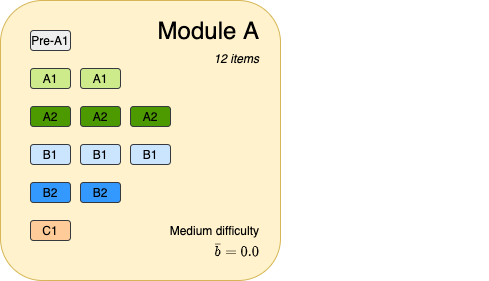

```{r setup, include=FALSE}
library(kableExtra)
library(tidyverse)
library(janitor)
library(ltm)

knitr::opts_chunk$set(
  comment = '', fig.width = 6, fig.height = 6
)
```

After making final decisions about test design, test development can start in earnest. In this post we describe what needs to be done before a MST can be finalized.

## Test Construction

Once the parameters of the test design are well established, the test designers should have a good idea of the number of modules, items and relative difficulties required. Where possible the simplest design is preferred. In our case for the sake of simplicity we'll go with design 1:

```{r mst-design-1, echo=FALSE, message=FALSE}
designParams <- read_csv('mst-designs.csv', skip = 1) %>%
  clean_names() %>%
  dplyr::select(-total)

displayParams <- designParams %>%
  rename(Design=design, `1`=stage1, `2`=stage2, `3`=stage3,
         A=module_a, B=module_b, C=module_c,
         D=module_d, E=module_e, F=module_f, G=module_g)

kbl(head(displayParams, n = 1), caption = 'MST Design 1') %>%
  kable_styling() %>%
  add_header_above(c(" ", "Stage" = 3, "Module" = 7))
```

### Item Writing

A process of item writing will then be undertaken. Subject matter experts (SMEs) will be brought in to help define the instructions for test writers. A set of items will then be created by the team of item writers. To take our test design example, we'll establish the number of items for each module that will be required at each CEFR level.

In general, the test designers will want to ensure that each module contains a balance of items of varying difficulty within the target ability range for each module. The Common European Frame of Reference (CEFR) is used to assign items into different ability levels (A1-C2). In our example, the 12 items in Module A cover all levels of the CEFR, as in Figure \@ref(fig:Module-A-Items).

```{r Module-A-Items, echo=FALSE, out.width="200%", out.height="200%", fig.cap="Module A Items"}

```

### Initial Validation of Item Quality

A group of raters (confusingly also called a panel of experts) will then be used to validate items in a level panel exercise, and ensure that they are set at the correct target CEFR level. Rating sheets are then collated and a decision then made on the CEFR rating for each item in the item bank. Various methods can be used to converge on an agreed CEFR level for each item; the simplest is to find the modal (ie. the most frequently occurring value) from all your raters. Where there is no single mode, or there are wide disagreements between raters, a manual adjustment to a commonly agreed CEFR level that is close to the average may be required. Ideally at least 5 raters would be used for each item to avoid this as far as possible.

Once CEFR levels are confirmed for each item, they can be used to update the item bank. Then it is a matter of assigning items to each module according to the test design.

### Initial Trialling

The purpose of the initial trial is to administer a test (a prototype panel) to a sample cohort of test takers Care should be taken to ensure that this cohort is representative of the target candidature.  Principles of sampling and research design will need to be carefully thought out. The actual test responses can then be used to calibrate item difficulties using the selected IRT model. We'll use the 1PL (Rasch) model in the examples that follow. 

#### Import and validation of trial data

The trial data is usually received as CSV or Excel files that comprise a candidate ID and then a set of responses (0 or 1) for each item. Not all items will have been taken by each candidate so there will be many NA values occurring. Data validation and cleaning to make sure the data from the field is correct and in the right format for processing are a key part of preparing the data from the trial so that it can be used in a Rasch analysis.

```{r Trial Data, echo=TRUE}
dfTestResponses <- read_csv('trial-data.csv')

kbl(head(dfTestResponses[1:8]), caption = 'Example Test Reponses') %>%
  kable_styling()
```

The `ltm` library can be used to fit a number of dichotomous and polytomous IRT models. It's the fastest R library that we've used for fitting a Rasch model. Before doing that we get some summary statistics from the data, including the *Cronbach's alpha* measure of covariance. 

#### Consistency and reliability

We want to make sure that our modules are internally consistent and reliable as tests of a given latent trait. In our test we've grouped various skills or abilities into the different stages. So, in our example, stage 1 (ie. Module A) is designed as a test of language use, stage 2 (Modules B and C) is designed to measure reading skills, and stage 3 is designed to measure listening skills. The overall test is designed to measure English language ability in non-native learners of English (regardless of age, which is a consideration that we are not covering here).

Cronbach's alpha is a function of the number of items in a test, the average covariance between pairs of items, and the variance of the total score. It is defined as:

$$
\alpha = \frac{p \times \bar{r}}{1 + (p – 1)\bar{r}}
$$

Here, $p$ is the number of items and $\bar{r}$ is the average of all covariances between items.

Since in our test we've split our items into different modules according to the skill that is being measured, so it makes sense to calculate alphas for each module, although we could also do so by stage if we wanted. We need to make sure that we remove any rows containing NA values before calculating Cronbach's alpha.

```{r Cronbachs alpha, echo=FALSE}
# create the `module` function to map module names to indices
moduleIndices <- seq(1:7)
moduleNames <- c('A', 'B', 'C', 'D', 'E', 'F', 'G')
names(moduleIndices) <- moduleNames
module <- function(n) { unname(moduleIndices[n]) }

# drop the Candidate column, it's not required for the IRT functions
dfTrial <- dplyr::select(dfTestResponses, -Candidate)

# now create per-module item response data frames, remembering to remove 
# any candidates who did not take the module
dfModuleAItems <- dfTrial %>% dplyr::select(1:12) %>% na.omit()
dfModuleBItems <- dfTrial %>% dplyr::select(13:20) %>% na.omit()
dfModuleCItems <- dfTrial %>% dplyr::select(21:28) %>% na.omit()
dfModuleDItems <- dfTrial %>% dplyr::select(29:38) %>% na.omit()
dfModuleEItems <- dfTrial %>% dplyr::select(39:48) %>% na.omit()
dfModuleFItems <- dfTrial %>% dplyr::select(49:58) %>% na.omit()
dfModuleGItems <- dfTrial %>% dplyr::select(59:68) %>% na.omit()

# calculate Cronbach's alpha for each module
alphasModuleA <- ltm::cronbach.alpha(dfModuleAItems, standardized = TRUE, na.rm = TRUE)
alphasModuleB <- ltm::cronbach.alpha(dfModuleBItems, standardized = TRUE, na.rm = TRUE)
alphasModuleC <- ltm::cronbach.alpha(dfModuleCItems, standardized = TRUE, na.rm = TRUE)
alphasModuleD <- ltm::cronbach.alpha(dfModuleDItems, standardized = TRUE, na.rm = TRUE)
alphasModuleE <- ltm::cronbach.alpha(dfModuleEItems, standardized = TRUE, na.rm = TRUE)
alphasModuleF <- ltm::cronbach.alpha(dfModuleFItems, standardized = TRUE, na.rm = TRUE)
alphasModuleG <- ltm::cronbach.alpha(dfModuleGItems, standardized = TRUE, na.rm = TRUE)

# create a composite data frame and plot the alphas and the number of samples
# we'll want to focus on modules that show a low alpha and a small number of samples
# as we may want to get more trial data for these, or look at the items to make
# sure they are testing the right skill (or both)
stage <- c(1, 2, 2, 3, 3, 3, 3)
alpha <- c(alphasModuleA$alpha, alphasModuleB$alpha, alphasModuleC$alpha,
            alphasModuleD$alpha, alphasModuleE$alpha, alphasModuleF$alpha,
            alphasModuleG$alpha)
num_items <- c(alphasModuleA$p, alphasModuleB$p, alphasModuleC$p,
            alphasModuleD$p, alphasModuleE$p, alphasModuleF$p,
            alphasModuleG$p)
num_responses <- c(alphasModuleA$n, alphasModuleB$n, alphasModuleC$n,
            alphasModuleD$n, alphasModuleE$n, alphasModuleF$n,
            alphasModuleG$n)

dfCronbachsAlpha <- data.frame(moduleNames, stage, num_items, num_responses, alpha)

kbl(dfCronbachsAlpha, caption = "Cronbach's Alpha") %>%
  kable_styling()

ggplot(dfCronbachsAlpha, 
       aes(x=alpha, y=num_responses, size = num_items, color = moduleNames)) +
    geom_point() +
    scale_x_continuous(limits = c(0, 1)) +
    theme(legend.position = "right") +
    labs(x = "alpha", y = "# responses") +
    geom_vline(xintercept = 0.7, linetype="dotted")
```

Ideally, we're looking for alphas of 0.7 and above; less than this indicates that there is weak covariance between the items in the module, which means they may not be testing the same trait. This measure is really only useful as a guide for further investigations; the ultimate decision on whether to modify the items in each module should be taken in collaboration with the subject matter experts. We can see that several of these values are really quite low; it should be borne in mind however that this is a simulated dataset that was generated for the purposes of testing the data pipeline. 

### Rasch Model

We're now ready to fit the Rasch model, using the `rasch` function in the `ltm` package:

```{r Rasch model}
# fit the Rasch model
raschmodel <- ltm::rasch(dfTrial, constraint = cbind(length(dfTrial) + 1, 1),
                     IRT.param = TRUE, start.val = "random")
rasch_summary <- summary(raschmodel)
```

### Item Difficulty

The item difficulty parameters $b_{i}$ are returned and then output to show the spread of difficulties. This is a useful way of gauging whether there are any outlier items that should be reviewed and possibly rejected. Items where there is no mix of 1s and 0s will show very extreme difficulty levels as the information for these items is extremely low.

```{r Item difficulties}
df_difficulties <- rasch_summary$coefficients

df_displayDifficulties <- data.frame(
  item_id = str_extract(row.names(df_difficulties), "(Item[0-9]+)"),
  b = as.vector(df_difficulties[,1])
)
df_displayDifficulties <- df_displayDifficulties %>%
  filter(str_detect(item_id, "(Item[0-9]+)"))

ggplot(data = na.omit(df_displayDifficulties)) +
  geom_bar(mapping = aes(x = reorder(item_id, -b), y = b), stat = "identity", fill = "cornflowerblue") +
  theme(axis.text.x = element_blank(), axis.ticks.x = element_blank()) +
  labs(x = "items", y = "Difficulty (b)")
```

This chart makes it easy to spot any outlier items that have a very large divergence from the mean; it is best to remove these items from the item bank as they have too large an error (or rather too little information) to be used in a live test. Usually this is the result of them having all 1's or 0's (in other words they are too easy or too difficult for all candidates who took them).

### Banking the Updated Difficulty Parameters

Once difficulty values have been calculated by fitting the Rasch model, the item bank should be updated to reflect this. The item difficulty ($b$ parameter) is a key component of the item, and should be stored along with the other information about the item (including its rated CEFR level by the subject expert panellists). If a 2PL model is being used, then the discrimination ($a$ parameter) would also be stored.

```{r Item banking}
# output a CSV file with the item difficulties
write_csv(df_displayDifficulties, "item-difficulties.csv")
```

### Item Characteristic Curves (ICCs)

The logistic function that describes an item's likelihood of being answered correctly can be represented visually like this, using the `plot` function from the `ltm` package:

```{r}
itemNo <- 7
itemID <- str_extract(rownames(df_difficulties)[itemNo], "Item\\d+")
itemDifficulty <- df_difficulties[itemNo]
itemPlot <- data.frame(plot(raschmodel, type = "ICC", items = itemNo, plot = FALSE))
colnames(itemPlot) <- c('theta', 'probability')
ggplot(itemPlot, aes(x=theta, y=probability)) + 
  geom_line() +
  labs(title="Item Characteristic Curve", x="theta", y="P(X=1)")
```

In this example Figure 12 we see the item characteristic curve (ICC) for `r itemID` with difficulty $b$ = `r itemDifficulty`.

### Module Characteristic Curves (MCCs)

You can sum the ICCs for all items in a module to get a Module Characteristic Curve (MCC) that expresses the difficulty for that module. These graphs show the relative difficulty of each module. They can be used to calibrate the modules so they are in line with the assumptions about module difficulty. The range of the difficulty of items as well as the mean module difficulty should also be checked and, if necessary, adjusted.

First we'll create a helper function called `trueScoreSummary` to convert the plot data we get from the `ltm` package into a format we can use for visualisations with `ggplot`.


```{r IRT helper functions}
# return a data frame with true score summaries
# that can then be plotted
trueScoreSummary <- function(plotData, module=NA) {
  data.frame(module = module, 
             theta = as.vector(plotData[,1]), 
             trueScore = as.vector(rowSums(plotData[,-1])))
}

# return a data frame with information coefficient summaries
# that can then be plotted
informationCoefficients <- function(plotData, module=NA) {
  data.frame(module = module, 
             theta = as.vector(plotData[,1]), 
             information = as.vector(rowSums(plotData[,-1])))
}
```

We get the indices of the module A items and then create the plotting data before graphing it.

```{r Stage 1 MCC}
moduleA1_items <- which(colnames(dfTrial) %in% colnames(dfModuleAItems))
plotData <- trueScoreSummary(plot(raschmodel, 
                                  type = "ICC", 
                                  items = moduleA1_items, plot = FALSE), 
                             "A")
ggplot(plotData, aes(x=theta, y=trueScore)) + 
  geom_line() +
  labs(title="Module Characteristic Curve (Stage 1)", x="theta", y="True Score")
```

We can go on to compare the MCCs for the stage 2 modules:

```{r Stage 2 MCCs}
moduleB1_items <- which(colnames(dfTrial) %in% colnames(dfModuleBItems))
moduleC1_items <- which(colnames(dfTrial) %in% colnames(dfModuleCItems))

plotData <- rbind(
  trueScoreSummary(plot(raschmodel, type = "ICC", items = moduleB1_items, plot = FALSE), "B"),
  trueScoreSummary(plot(raschmodel, type = "ICC", items = moduleC1_items, plot = FALSE), "C")) 

ggplot(plotData, aes(x=theta, y=trueScore)) + 
  geom_line(aes(colour=module)) +
  labs(title="Module Characteristic Curves (Stage 2)", x="theta", y="True Score")
```

Looking at Figure 14, a problem we can already see is that these curves look very straight - ideally there should be a nice sigmoid shape to them. These MCCs have a low information content - in other words they are not very discriminating. We may want to move some items between modules, or reject items that have poor discrimination, or even go back to the drawing board and add some more quality items.

And for the modules in stage 3:

```{r Stage 3 MCCs}
moduleD1_items <- which(colnames(dfTrial) %in% colnames(dfModuleDItems))
moduleE1_items <- which(colnames(dfTrial) %in% colnames(dfModuleEItems))
moduleF1_items <- which(colnames(dfTrial) %in% colnames(dfModuleFItems))
moduleG1_items <- which(colnames(dfTrial) %in% colnames(dfModuleGItems))

plotData <- rbind(
  trueScoreSummary(plot(raschmodel, type = "ICC", items = moduleD1_items, plot = FALSE), "D"),
  trueScoreSummary(plot(raschmodel, type = "ICC", items = moduleE1_items, plot = FALSE), "E"),
  trueScoreSummary(plot(raschmodel, type = "ICC", items = moduleF1_items, plot = FALSE), "F"),
  trueScoreSummary(plot(raschmodel, type = "ICC", items = moduleG1_items, plot = FALSE), "G")) 

ggplot(plotData, aes(x=theta, y=trueScore)) + 
  geom_line(aes(colour=module)) +
  labs(title="Module Characteristic Curves (Stage 3)", x="theta", y="True Score")
```

All of the modules are quite similar in terms of difficulty (the MCCs are quite close to each other), and moreover the lines are quite flat - there is little discrimination between them. So we may want to look at moving some items between modules, or rejecting items with poor discrimination,

## Cut scores and scale scores

In this section, we'll show how to use the Module Information Function (MIF) to derive cut scores for module progression, and also how to build a scale scoring system for the test. First, we'll cover the topic of deriving scale scores for each module and then for the test.

### Scale Scores for Test Reporting

It would be possible to provide candidates with their $\hat{\theta}$ at the end of the test. However most candidates and testing organisations do not like theta values; the concept of zero as the population mean, or negative ability values are difficult for many people to conceptualise. We decide therefore to convert the theta value into a scale score for reporting purposes. This usually involves fitting the theta to a range that is chosen by the testing body and acceptable for its stakeholders (for example a score in the range 20-80).

Before we get to that point however we'll cover the case where the test administration system is unable to calculate the theta estimate and we need to provide a true score to scale score mapping. We do this by first converting true score to theta estimate, and then mapping the theta estimate on to a scale score. True score is simply the number correct (NC) for a given module.

#### Converting True Score to Theta

Recall that the MCCs provide a mapping from the number of correct scores for each module to an ability estimate: $\hat{\theta}$. A quintic polynomial can be used to fit the MCC, and the resulting coefficients of this polynomial function can then used by the test administration system to provide an ability estimate at the end of each module. The scale scores can then be used to provide an aggregated test score once the final stage of the MST has completed.

Effectively we use a polynomial regression to map the non-linear relationship between the number correct that a candidate scores and the ability estimate based on the items in that module. This is possible because of the direct summative relationship between ICCs and MCCs to derive ability estimates. You may ask why do we need to go to the trouble of fitting a seperate regression to what is a effectively a sum of logistic regressions? The difficulty here arises for test administration systems where the item difficulties are unknown (because access to these values from the item bank is unavailable), or the system is not capable of using the IRT functions to compute the ICCs and MCCs from the item parameters. The number of possible values is limited anyway (the number correct value for a module will be $n + 1$, where $n$ is the number of items in the module), so another approach is to simply store the NC to ability estimate equivalences in a table for lookup during test administration.

A different approach that is worth considering is the use of the D-Scores (see @han2019developing). We have not had time to undertake a full investigation of the D-Scoring method, but it is certainly something we intend to look at in a future article.

#### Module A Mapping Function

Here we show how to use a polynomial regression to fit a set of coefficients to the MCC.

```{r Module A True Scores, echo=FALSE}
df_moduleA_TS <- trueScoreSummary(plot(raschmodel, type = "ICC", items = moduleA1_items, plot = FALSE))

# use a quintic polynomial regression to model the MCC
lm_moduleA_scores_poly <- lm(theta ~ poly(trueScore, degree=5, raw=TRUE), data = df_moduleA_TS)

# show a summary of the polynomial regression
summary(lm_moduleA_scores_poly)
```

The low p-values indicate that this is a useful model for our purpose. From here we pull out the coefficients (terms) that will be used for the polynomial function.

```{r Module A True Score Function}
gA_coeffs <- unname(coef(lm_moduleA_scores_poly))

(gA_coeffs)
```

In order to calculate the ability for a candidate, such a function can be used to map from the number correct (NC) score to an estimated theta for candidate $i$: $\hat\theta_i$. The $g_A()$ function that will be used for module A could be written as an R function like this:

```{r}
gA <- function(x) {
  return(gA_coeffs[6]*x^5 + gA_coeffs[5]*x^4 + gA_coeffs[4]*x^3 + 
           gA_coeffs[3]*x^2 + gA_coeffs[2]*x + gA_coeffs[1])
}
```

The parameter `x` is the NC score. So, a candidate who scores 9 out of 12 on module A would have a $\hat\theta$ = `r gA(9)`.

#### Validating the Mapping Function

We saw previously that the low p-value for the polynomial regression indicates a very good fit to the MCC. We can show this visually by overlaying the data points derived from the $g_A()$ function onto the original MCC for module A:

```{r}
df_gA <- data.frame(
  trueScore = c(seq(0,12)),
  theta = c(rep(0, 13))
)
df_gA$theta <- gA(df_gA$trueScore)

# plot the theta/true score curve
ggplot(df_moduleA_TS, aes(x = theta, y = trueScore)) +
  geom_line(color = "red", linetype="dashed") +
  geom_point(data = df_gA, aes(x = theta, y = trueScore)) +
  scale_x_continuous(name="theta", limits=c(-4, 4)) +
  scale_y_continuous(name="True Score", limits=c(0, 12), 
                     minor_breaks = NULL, n.breaks = 12)
```

We can see that it is a good fit - the black dots that are dervied from applying $g_A()$ to each possible true score show very little error from the original MCC (red dotted line). This is true both in the middle of the range, and importantly at the upper and lower bounds.

We then need to go through each module in every panel and create a true score mapping function for each. These functions, or the lookup-tables that they can be used to generate, will then need to be provided to the developers of the test delivery software so that they can be used to calculate theta estimates and scale scores for each module.

#### Scale Scoring Function

A scale score function can then be created to map the $\hat{\theta}$ to a score that will be reported back to the candidate and the testing institute. We'll see an example later in this section. 

At the end of the test the test taker will typically be provided with a summary of competence such as a CEFR band achieved. They will also most likely be provided with some illustrative descriptors, along with the scale score.

The test administrators may want to create different scale score functions for each stage of the MST, although the simplest approach is to just have a single one. A straightforward scaling function to use is to simply normalise the ability estimate for a candidate to a range 0-1 and then apply a multiplier constant $k$:

$$
f(\hat{\theta}_i) = k\frac{\hat{\theta}_i - min(\theta)}{max(\theta) - min(\theta)}
$$

Usually the scale score would be rounded to a whole number. For example, in R the scaling function might look like this:

```{r}
s <- function(thetaEstimate, thetaRange) {
  k <- 100
  round((thetaEstimate - thetaRange[1]) / (thetaRange[2] - thetaRange[1]) * k)
}

scaleScore <- s(thetaEstimate = 0.95, thetaRange = c(-4, 4))

(scaleScore)
```

More complex scaling functions that use additional terms can also be used to tailor the reporting score range to the requirements of the test institute.

### Cut scores for routing

We use the concept of the information function as a way of determining the best cut scores to use. Where a choice is needed to route onward to the next stage, we need to select a cut score to use. We could do this by simply selecting a mid-point in the true scale. For example, if the routing Module A has 12 items, then we might assume that if a candidate scores 0-5 they route to the easy module in the next stage (Module B), and if they score 6-12 they route to the harder module (Module C). Ideally though we'd like to base this on the results of the Rasch analysis. Using the Item Information Function (IIF) gives us a way of selecting a cut score based on IRT. First lets explain the Item Informtation Function.

#### Item Information Functions (IIFs)

We mentioned earlier that the IIF provides a way of showing at what ability level an item is most discriminating. The IIF can be represented visually like this, using the `plot` function from the `ltm` package:

```{r Item Information Function}
itemNo <- 7
itemID <- str_extract(rownames(df_difficulties)[itemNo], "Item\\d+")
itemDifficulty <- df_difficulties[itemNo]
itemPlot <- data.frame(plot(raschmodel, type = "IIC", items = itemNo, plot = FALSE))
colnames(itemPlot) <- c('theta', 'information')
ggplot(itemPlot, aes(x=theta, y=information)) + 
  geom_line() +
  labs(title="Item Information Function", x="theta", y="I(theta)")
```

For example this item shows a peak information for $\hat{\theta} =$ `r itemPlot$theta[which.max(itemPlot$information)]`. 

#### Module Information Functions (MIFs)

Just as with the ICC-MCC relationship, its possible to sum a set of IIFs into a Module Information Function (MIF).

Routing between modules can then be determined by cut scores derived from the intersection of information functions for the modules in the next stage. We should aim to place the cut score at the location where the MIFs intersect.

To see an example of this let's look at the MIFs for the two stage 2 modules:

```{r Stage 2 MIFs}
iifB <- informationCoefficients(plot(raschmodel, type = "IIC", 
                               items = moduleB1_items, plot = FALSE), 
                               "B")
iifC <- informationCoefficients(plot(raschmodel, type = "IIC", 
                               items = moduleC1_items, plot = FALSE), 
                               "C")

plotData <- rbind(iifB, iifC)

stage2IIFs <- inner_join(iifB, iifC, by = "theta") %>%
  rename(moduleB = information.x, moduleC = information.y) %>%
  dplyr::select(theta, moduleB, moduleC) %>%
  arrange((abs(moduleB - moduleC))) %>%
  head(n = 1)
cutTheta <- stage2IIFs$theta

ggplot(plotData, aes(x=theta, y=information)) + 
  geom_line(aes(colour=module)) +
  labs(title="Module Information Function", x="theta", y="I(theta)") +
  geom_vline(xintercept = cutTheta, linetype="dotted")

cutScore <- round(df_moduleA_TS$trueScore[which.min(abs(df_moduleA_TS$theta - cutTheta))])
```

Here in Figure 18 we can see that there is a point of intersection between Modules B and C where the ability estimate is `r cutTheta`. If we read off the true score value that is equivalent for this theta estimate in Module A, then we can use this as the cut score; in this case the (rounded) true score is `r cutScore`.

# Summary

We've seen how to take a test from the design stage to validation of the items, Rasch analysis, banking of item difficulties, functions for calculation of ability estimates and scale scores, and finally calculation of the cut scores that will be used for routing.

Once this information has been calculated and provided to the software engineers of the computerised test delivery platform it is then available to the test delivery system and the test is theoretically ready for delivery. It is usual at this stage to run a further larger scale field test (trial) to iron out any operational issues.

# References
